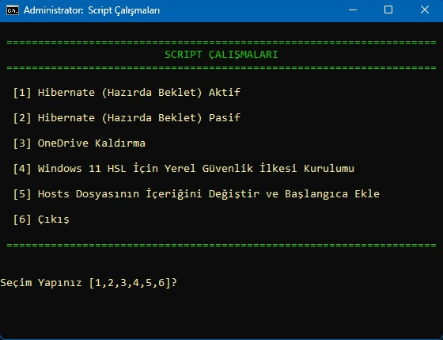

<h1 align="center">⭐ CMD SCRIPTS ⭐</h1>

I am presenting to you the command prompt script I compiled for use on my personal computer.

You can use it on Windows 7/8/10/11 operating systems.

## 📌 Screenshots

## 📌 Main Features
- Light/dark mode toggle
- Open `.m3u` and `.m3u8` playlists

## 📌 How to Use
1. Open the live demo or run `index.html` locally.
2. Choose your `.m3u` or `.m3u8` file.
3. Edit groups, channels, URLs, and metadata.
4. Select channels and click **Check** to test only those channels.
5. Use **Sort** to sort channels A-Z or by status.
6. Click **Download Modified M3U** when you are done.

---

> [!NOTE]
> 🕰️ Updated on July 10, 2026

---

❤️ Made with Love ❤️

---

## 📌 How to Use
You can download the scripts.cmd to your computer, right-click the setup.inf installation file and select install, or download the file from the releases folder and run it as administrator.

---

> [!NOTE]
> 🕰️ Updated on July 10, 2026

---

❤️ Made with Love ❤️

---
